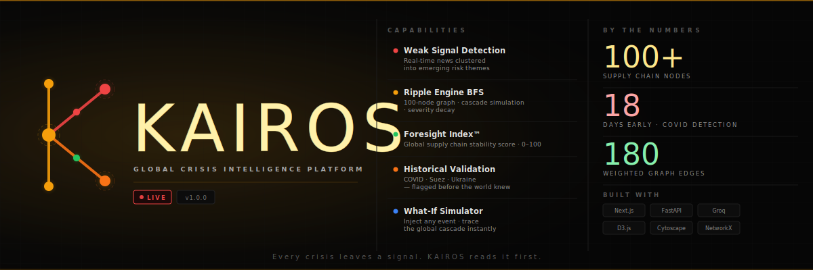

<div align="center">

# KAIROS
### *Foresee the moment. Before the world breaks.*

<br/>

[](https://kairos-gules.vercel.app)
[](https://kairos-production-a30d.up.railway.app/docs)

<br/>

[](https://fastapi.tiangolo.com)
[](https://nextjs.org)
[](https://groq.com)
[](https://python.org)
[](https://typescriptlang.org)
[](LICENSE)

<br/>

> **Built for KodeMaster.ai Hackathon 2026** — *Where AI Meets Real Builders*
</div>
---
<br/>

<br/>



<br/>
<br/>


## The Problem

Every major global crisis left signals **weeks before** it made headlines.

- 🦠 **COVID-19** — Factories shutting in Wuhan were detectable **18 days** before WHO declared emergency
- 🚢 **Suez Canal blockage** — Weather + vessel traffic patterns were detectable **hours** before grounding  
- 🌾 **Ukraine grain crisis** — Troop movements + wheat futures + fertilizer shortages were clustering **14 days** before invasion

Humans can't connect these dots fast enough. **KAIROS can.**

---

## What is KAIROS?

KAIROS is a real-time global crisis intelligence platform with three core layers:

**🔴 Signal Harvester** — Monitors global news across 14 supply chain and geopolitical categories, clusters weak signals into risk themes using AI, and scores each cluster with a proprietary **Kairos Score™** (0–100)

**🧠 Ripple Engine** — A 100-node supply chain knowledge graph traversed with BFS. Any disruption triggers a cascade simulation — hop by hop, with severity decay, time-to-impact estimates, and affected company mapping

**📊 Kairos Foresight Index™** — A single global number representing current supply chain stability. Updates every 30 minutes. Think Dow Jones — but for global crisis risk.

---

## Features

| | Feature | Description |
|---|---|---|
| 🔴 | **Live Signal Feed** | Real-time news clustered into risk themes with velocity detection |
| 🧠 | **Ripple Engine** | BFS graph traversal with severity decay across 100 supply chain nodes |
| ⚡ | **What-If Simulator** | Inject any hypothetical event, trace its full global cascade |
| 🗺️ | **Global Risk Map** | D3 + TopoJSON world map — affected countries colored by severity |
| 📈 | **Ripple Graph** | Animated Cytoscape.js visualization with node hover tooltips |
| 📅 | **Crisis Timeline** | Cascade bucketed into T+72h / T+1wk / T+1mo / T+3mo |
| 🕰️ | **Historical Validation** | 3 real past crises — KAIROS would have flagged them 0–18 days early |
| 📄 | **PDF Crisis Brief** | One-click boardroom-ready report generated by LLM + ReportLab |
| 🎯 | **Kairos Score™** | Proprietary 0–100 crisis escalation scoring per event and cluster |

---

## Architecture

```
┌──────────────────────────────────────────────────────────────┐
│                          KAIROS                              │
│                                                              │
│   NewsAPI ──► Signal Harvester ──► LLM Clustering            │
│                                         │                    │
│                                    Risk Clusters             │
│                                    Kairos Score™             │
│                                         │                    │
│   User Event ──► Event Parser ──► Ripple Engine ──► Output   │
│                       │               │                      │
│                  LLM Extraction   Knowledge Graph            │
│                                   100 nodes · 180 edges      │
│                                   BFS · Severity Decay       │
└──────────────────────────────────────────────────────────────┘
                              │
               ┌──────────────▼──────────────┐
               │       FastAPI Backend       │
               │   REST API — 5 endpoints    │
               │   Railway · Production      │
               └──────────────┬──────────────┘
                              │
               ┌──────────────▼──────────────┐
               │     Next.js 14 Frontend     │
               │   Dashboard · Simulator     │
               │   Historical · Signals      │
               │   Vercel · Production       │
               └─────────────────────────────┘
```

---

## Knowledge Graph

**100 nodes · 180 weighted edges** encoding real-world supply chain dependencies.

| Type | Count | Examples |
|---|---|---|
| Countries | 25 | Taiwan, China, USA, Ukraine, Saudi Arabia, Iran |
| Industries | 15 | Semiconductors, Automotive, Pharma, Energy, Shipping |
| Commodities | 11 | Crude Oil, Natural Gas, Wheat, Lithium, Rare Earths |
| Ports | 7 | Shanghai, Singapore, Rotterdam, Los Angeles, Dubai |
| Trade Routes | 6 | Suez Canal, Strait of Hormuz, Malacca, Panama Canal |
| Companies | 26 | TSMC, ASML, Aramco, Maersk, Apple, Boeing, Pfizer |

---

## Tech Stack

| Layer | Technology | Purpose |
|---|---|---|
| Frontend | Next.js 14 + TypeScript | App shell, routing |
| Styling | Tailwind CSS | Utility-first styling |
| Graph Visualization | Cytoscape.js | Ripple propagation graph |
| World Map | D3.js + TopoJSON | Choropleth risk map |
| Animations | Framer Motion | UI transitions |
| Backend | FastAPI + Python 3.12 | REST API |
| LLM | Groq API (Llama 3.3 70B) | Event parsing, clustering, narratives |
| Graph Engine | NetworkX | BFS traversal |
| News Data | NewsAPI | Live global headlines |
| PDF Generation | ReportLab | Crisis brief export |
| Data Validation | Pydantic v2 | Request/response schemas |

---

## Getting Started

### Prerequisites
- Python 3.11+
- Node.js 18+
- Groq API key — free at [console.groq.com](https://console.groq.com)
- NewsAPI key — free at [newsapi.org](https://newsapi.org)

### Backend
```bash
cd backend
python3 -m venv venv
source venv/bin/activate
pip install -r requirements.txt
cp .env.example .env
# Add your API keys to .env
uvicorn app.main:app --reload --port 8000
```

### Frontend
```bash
cd frontend
npm install
cp .env.local.example .env.local
# Set NEXT_PUBLIC_API_URL=http://localhost:8000
npm run dev
```

Open [http://localhost:3000](http://localhost:3000)

---

## Environment Variables

**`backend/.env`**
```env
GROQ_API_KEY=your-groq-key
NEWS_API_KEY=your-newsapi-key
APP_ENV=development
CORS_ORIGINS=http://localhost:3000
```

**`frontend/.env.local`**
```env
NEXT_PUBLIC_API_URL=http://localhost:8000
NEXT_PUBLIC_APP_NAME=KAIROS
NEXT_PUBLIC_APP_VERSION=1.0.0
```

---

## API Reference

| Method | Endpoint | Description |
|---|---|---|
| `POST` | `/api/v1/analyze` | Analyze a real disruption event |
| `POST` | `/api/v1/simulate` | Run a hypothetical What-If simulation |
| `GET` | `/api/v1/signals` | Live signal clusters + Kairos Foresight Index |
| `GET` | `/api/v1/historical` | Historical validation events |
| `POST` | `/api/v1/report` | Generate PDF crisis brief |
| `GET` | `/health` | Backend health check |

### Example
```bash
curl -X POST https://kairos-production-a30d.up.railway.app/api/v1/analyze \
  -H "Content-Type: application/json" \
  -d '{"description": "Taiwan semiconductor production drops 30% due to earthquake"}'
```

---

## Demo Scenarios

| Scenario | Origin | Expected Score |
|---|---|---|
| Taiwan Semiconductor Shock | TWN / SEMI | 65–75 |
| Suez Canal Blockage | TR_SUEZ | 70–80 |
| Ukraine Grain Export Halt | UKR / WHEAT | 75–85 |
| Strait of Hormuz Closure | TR_HORMUZ | 80–90 |
| China Manufacturing Shutdown | CHN | 75–85 |

---

## Historical Validation

| Crisis | Score | Days Early | Actual Impact |
|---|---|---|---|
| COVID-19 Supply Chain (Feb 2020) | 67 | **18 days** | $4T lost trade, 2yr disruption |
| Suez Canal Blockage (Mar 2021) | 74 | **Same day** | $9.6B/day, 369 vessels stuck |
| Ukraine Grain Crisis (Feb 2022) | 81 | **14 days** | Wheat +60%, crisis in 45 countries |

---

## Project Structure

```
kairos/
├── backend/
│   └── app/
│       ├── data/knowledge_graph.json    # 100-node supply chain graph
│       ├── models/schemas.py            # Pydantic models
│       ├── routes/                      # analyze, signals, simulate, historical, report
│       ├── services/
│       │   ├── claude_service.py        # LLM interactions (Groq)
│       │   ├── ripple_engine.py         # BFS cascade algorithm
│       │   ├── signal_harvester.py      # News ingestion + clustering
│       │   └── report_generator.py     # PDF builder
│       └── main.py
└── frontend/
    ├── app/page.tsx                     # Main app + all views
    ├── components/
    │   ├── dashboard/                   # KairosScorePanel, SignalFeed, CrisisTimeline
    │   ├── graph/                       # RippleGraph, WorldMap
    │   ├── layout/                      # Navbar, Sidebar
    │   ├── simulator/                   # WhatIfInput, SimulatorPanel
    │   └── ui/                          # Badge, ScoreRing, Ticker, LoadingPulse
    ├── hooks/                           # useRipple, useSignals, useKairosScore
    ├── lib/                             # api.ts, utils.ts, constants.ts
    └── types/index.ts
```

---

## Credits & Acknowledgements

| Resource | Usage | Link |
|---|---|---|
| **Groq** | LLM inference — Llama 3.3 70B (free tier) | [groq.com](https://groq.com) |
| **NewsAPI** | Live global news headlines (free tier) | [newsapi.org](https://newsapi.org) |
| **NetworkX** | Graph data structures + BFS traversal | [networkx.org](https://networkx.org) |
| **Cytoscape.js** | Interactive graph visualization | [cytoscape.org](https://cytoscape.org) |
| **D3.js** | World map + data visualization | [d3js.org](https://d3js.org) |
| **TopoJSON / world-atlas** | Country boundary data | [github.com/topojson](https://github.com/topojson/world-atlas) |
| **ReportLab** | PDF generation | [reportlab.com](https://reportlab.com) |
| **Framer Motion** | UI animations | [framer.com/motion](https://framer.com/motion) |
| **Pydantic** | Data validation | [docs.pydantic.dev](https://docs.pydantic.dev) |
| **FastAPI** | Python web framework | [fastapi.tiangolo.com](https://fastapi.tiangolo.com) |
| **Next.js** | React framework | [nextjs.org](https://nextjs.org) |
| **Tailwind CSS** | Utility CSS framework | [tailwindcss.com](https://tailwindcss.com) |
| **Lucide React** | Icon library | [lucide.dev](https://lucide.dev) |

---

<div align="center">

<br/>

**KAIROS** · Global Crisis Intelligence · v1.0.0

*Every crisis leaves a signal. KAIROS reads it first.*


</div>